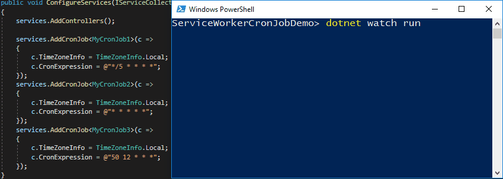

# Service Worker Cron Jobs Demo
 => Lập lịch cron jobs bằng HostedService tùy chỉnh trong dự án ASP.NET Core Web API. Bản ghi màn hình sau đây cho thấy nhật ký thời gian chạy cho ứng dụng cuối cùng, có ba tác vụ nền chạy sau mỗi 5 phút, sau mỗi 1 phút và mỗi ngày lúc 12:50 PM.

## Đặng Đức Thuần
